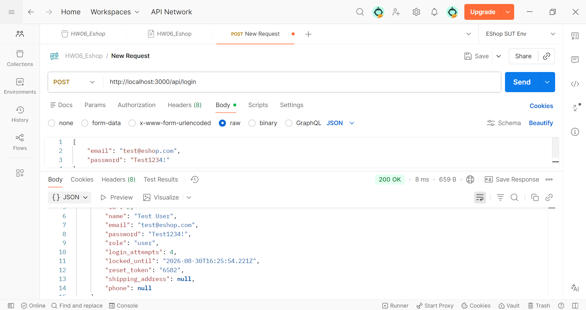
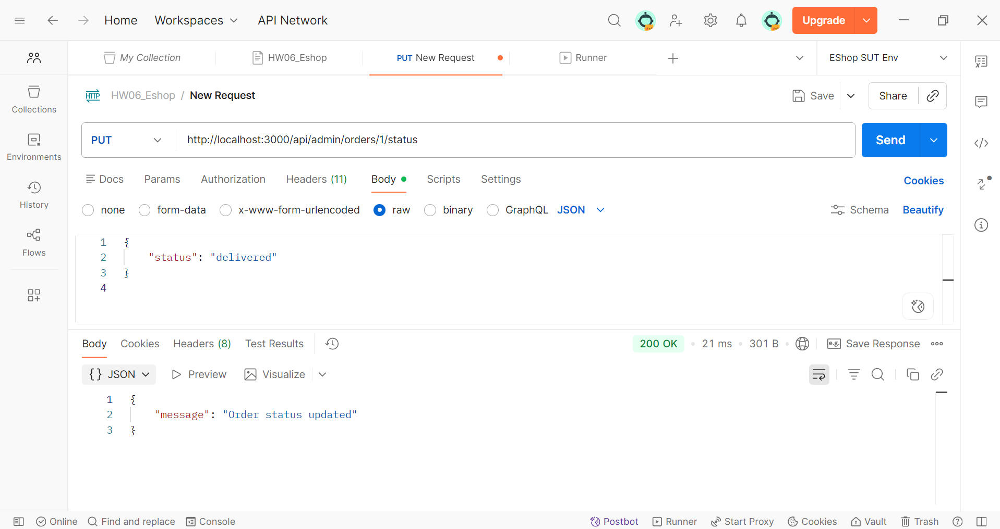
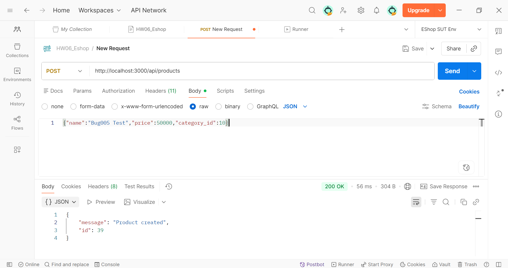
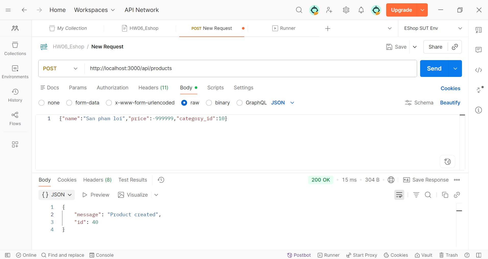
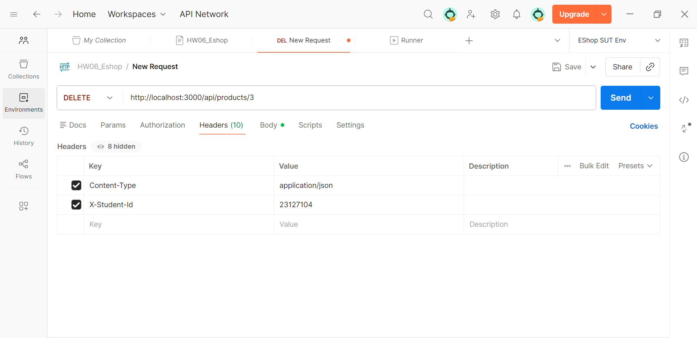
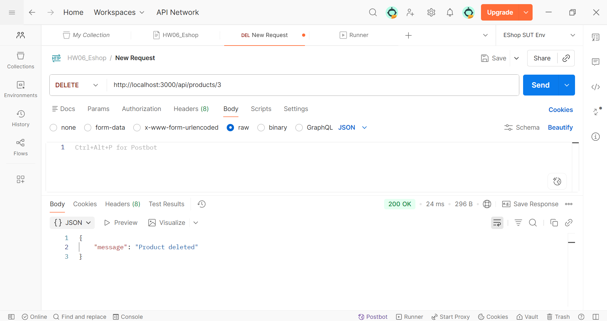

# Bug Report

## Summary

| Bug ID | Title | Requirement | Severity | Status | Found by | GitHub Issue |
| :--- | :--- | :--- | :--- | :--- | :--- | :--- |
| `BUG-001` | Trả về mật khẩu plaintext và metadata xác thực qua API Login | `FR-02`, `SEC-01` | `Critical` | `Confirmed` | `AI-suggested` | [Issue #1](https://github.com/nbmp2005/SoftwareTesting-HW06-23127104/issues/1) |

| `BUG-002` | Cho phép bỏ qua/chuyển khỏi trạng thái ngoài state machine | `FR-10` | `High` | `Confirmed` | `AI-suggested` | [Issue #2](https://github.com/nbmp2005/SoftwareTesting-HW06-23127104/issues/2) |
| `BUG-003` | Nghi vấn privilege escalation ở API trạng thái đơn hàng | `FR-12`, `SEC-03` | `Critical` | `Triage pending — current run does not reproduce` | `AI-suggested` | [Issue #3](https://github.com/nbmp2005/SoftwareTesting-HW06-23127104/issues/3) |
| `BUG-004` | Nghi vấn race condition khi cập nhật đồng thời | `FR-10` | `High` | `Triage pending — current run does not reach race oracle` | `AI-suggested` | [Issue #4](https://github.com/nbmp2005/SoftwareTesting-HW06-23127104/issues/4) |

| `BUG-005` | HTTP 200/body tối giản khi tạo/sửa sản phẩm | `FR-15` | `Low` | `Rejected — response contract is unspecified` | `AI-suggested` | [Issue #5](https://github.com/nbmp2005/SoftwareTesting-HW06-23127104/issues/5) |
| `BUG-006` | Chấp nhận sản phẩm thiếu trường bắt buộc/giá không hợp lệ | `FR-15` | `High` | `Confirmed` | `AI-suggested` | [Issue #6](https://github.com/nbmp2005/SoftwareTesting-HW06-23127104/issues/6) |
| `BUG-007` | Guest/User thường có thể thay đổi dữ liệu sản phẩm | `FR-12`, `SEC-02`, `SEC-03` | `Critical` | `Confirmed` | `AI-suggested` | [Issue #7](https://github.com/nbmp2005/SoftwareTesting-HW06-23127104/issues/7) |

Chỉ các mục có trạng thái `Confirmed` được tính vào genuine-bug metrics: **4 bug** (`BUG-001`, `BUG-002`, `BUG-006`, `BUG-007`). Các Issue #3–#5 được giữ lại để bảo toàn lịch sử; cần cập nhật/đóng trên GitHub sau khi sinh viên xác nhận kết quả triage này.

## Bug template

### BUG-001 – Trả về mật khẩu plaintext và metadata xác thực qua API Login

- **Requirement violated:** `SEC-01` quy định mật khẩu không được lưu plaintext; response login quan sát được trả lại đúng mật khẩu plaintext của fixture, cùng `login_attempts`, `locked_until` và `reset_token`.
- **Severity / priority:** `Critical`. Bất kỳ client đăng nhập thành công nào cũng nhận credential và metadata xác thực không cần thiết.
- **Environment:** Node.js Backend EShop, Newman v5+, `localhost:3000`
- **Preconditions:** Có một tài khoản hợp lệ trong hệ thống.
- **Related test case:** `FR02-AI-001` đến `FR02-AI-005`
- **AI involvement:** AI found. AI sinh ra các Test Case kiểm tra Schema và Security, phát hiện rò rỉ dữ liệu ngoài mong muốn.

#### Steps to reproduce

1. Khởi động EShop API Backend.
2. Gửi request `POST /api/login` với thông tin đăng nhập hợp lệ.
3. Kiểm tra JSON response trả về, đặc biệt trong object `user`.

#### Expected result

Response trả về Status `200 OK`, có `token` và thông tin `user` cơ bản. TUYỆT ĐỐI KHÔNG chứa trường `password`, `login_attempts`, `locked_until`, hoặc `reset_token`.

#### Actual result

Response có chứa tất cả các trường nhạy cảm nêu trên; screenshot cho thấy trường `password` bằng đúng mật khẩu plaintext của tài khoản test.
*(Trích log Newman: `sensitive fields found: $.user.password, $.user.login_attempts, $.user.locked_until, $.user.reset_token: expected [ '$.user.password', ... ] to be empty`)*.

#### Reproducibility and impact

- Reproduction evidence: quan sát trong `1/1` suite run hiện có; 5 test case liên quan (`FR02-AI-001`–`005`) đều ghi nhận cùng nhóm trường nhạy cảm.
- Impact: Rất nghiêm trọng (Data privacy/Security breach).
- Workaround: Cần sửa DTO/Mapper của Backend để bỏ các trường này trước khi trả về.

#### Evidence

- Screenshot:
  
- Newman/Postman evidence: `newman-report-FR02-ai.json`
- GitHub Issue: [Issue #1](https://github.com/nbmp2005/SoftwareTesting-HW06-23127104/issues/1)

---

### BUG-002 – Cho phép bỏ qua/chuyển khỏi trạng thái ngoài state machine

- **Requirement violated:** `FR-10` (Order State Machine quy định rõ các trạng thái hợp lệ. Ví dụ: Đơn đã `canceled` không thể chuyển về `pending` hay `confirmed`).
- **Severity / priority:** `High`. Làm sai lệch quy trình kinh doanh nghiệp vụ, có thể gây thất thoát hàng hóa.
- **Environment:** Node.js Backend EShop, Newman v5+, `localhost:3000`
- **Preconditions:** Có các order fixture ở trạng thái `pending` và `canceled` trước request tương ứng.
- **Related test case:** `FR10-AI-003`, `FR10-AI-004`, `FR10-AI-009`, `FR10-AI-024`.
- **AI involvement:** AI found. Kịch bản Data-driven đã vét cạn tất cả 25 cặp trạng thái có thể, phát hiện lỗ hổng kiểm soát trạng thái.

#### Steps to reproduce

1. Khởi động EShop API Backend và chuẩn bị một đơn `pending`.
2. Gửi `PUT /api/admin/orders/{id}/status` với body `{"status":"shipping"}` (bỏ qua `confirmed`).
3. Kiểm tra JSON response và Status Code.

#### Expected result

Response phải là lỗi `4xx` vì `pending → shipping` không nằm trong state machine.

#### Actual result

Artifact `newman-report-FR10.json` ghi nhận `FR10-AI-003` trả `200` với `{"message":"Order status updated"}` và hậu trạng thái là `shipping`. Các case `AI-004`, `AI-009`, `AI-024` cho thấy thêm các chuyển đổi bỏ bước/chuyển khỏi final state được chấp nhận.

#### Reproducibility and impact

- Reproduction evidence: `1/1` suite run hiện có; xem các TC liên quan và assertion trong artifact JSON.
- Impact: Nghiêm trọng (Business Logic Breach).
- Workaround: Backend cần bổ sung hàm kiểm tra State hợp lệ (vd: dùng State Machine library hoặc if-else map) trước khi cho phép update DB.

#### Evidence

- Screenshot:
  
- Newman/Postman evidence: `newman-report-FR10.json`
- GitHub Issue: [Issue #2](https://github.com/nbmp2005/SoftwareTesting-HW06-23127104/issues/2)

---

### BUG-003 – Lỗi Phân Quyền (Privilege Escalation) - User thường đổi được trạng thái

> **Triage pending; không tính là genuine bug.** Run hiện tại không tái hiện actual result được ghi trên Issue #3. `FR10-AI-035` nhận `400`, không phải `200`, và order mục tiêu đã bị các iteration trước làm bẩn thành `delivered`. Hai token user trong data run còn trùng identity, nên các probe ownership cũng chưa độc lập.

- **Requirement violated:** `FR-10` (Chỉ có quyền Admin mới được gọi API đổi trạng thái từ pending sang confirmed, shipping, delivered).
- **Severity / priority:** `Critical`. Lỗ hổng bảo mật chết người (IDOR / Broken Access Control).
- **Environment:** Node.js Backend EShop, Newman v5+, `localhost:3000`
- **Preconditions:** Có một đơn hàng ở trạng thái `pending`. User đăng nhập hợp lệ với role thường.
- **Related test case:** `FR10-AI-031`, `FR10-AI-032`, `FR10-AI-035`.
- **AI involvement:** AI found. Nhờ tạo token User động trong Setup, AI phát hiện User thường cũng chọc được vào API admin.

#### Steps to reproduce

1. Khởi động EShop API Backend.
2. Gửi request `PUT /api/admin/orders/{id}/status` bằng token của User thường (không phải Admin).

#### Expected result

Response trả về Status `403 Forbidden`.

#### Actual result

Expected `403`, nhưng run hiện tại trả `400 Invalid state transition from delivered to confirmed`; không chứng minh role bypass. Cần reset order về `pending`, dùng hai user khác nhau, rồi rerun riêng case này.

#### Reproducibility and impact

- Reproduction evidence: chưa có run sạch tái hiện `200`; evidence hiện tại mâu thuẫn với claim.
- Impact: Đặc biệt Nghiêm trọng (Critical Security Breach). Khách hàng có thể tự đổi đơn hàng của mình thành `delivered` để quỵt tiền.
- Workaround: Backend cần check `req.user.role === 'admin'` trong endpoint `/api/admin/orders/:id/status`.

#### Evidence

- Screenshot:
  
- Newman/Postman evidence: `newman-report-FR10.json`
- GitHub Issue: [Issue #3](https://github.com/nbmp2005/SoftwareTesting-HW06-23127104/issues/3)

---

### BUG-004 – Lỗi Race Condition - Thiếu cơ chế khóa (Lock) khi cập nhật đồng thời

> **Triage pending; không tính là genuine bug.** `FR10-H-004` trong run hiện tại nhận `400+400` vì fixture đã ở `delivered`, không phải `200+200`; do đó race oracle chưa được thực thi trên precondition hợp lệ.

- **Requirement violated:** `FR-10` (Concurrent updates). Khi có 2 request đồng thời cố gắng cập nhật trạng thái của cùng 1 đơn hàng, chỉ 1 request được thành công (200), request còn lại phải bị từ chối (409 Conflict hoặc 400).
- **Severity / priority:** `High`.
- **Environment:** Node.js Backend EShop, Newman v5+, `localhost:3000`
- **Preconditions:** Có một đơn hàng ở trạng thái `pending`.
- **Related test case:** `FR10-H-004`.
- **AI involvement:** AI found. Kiểm tra bằng cách bắn song song (Promise.all).

#### Steps to reproduce

1. Bắn 2 request `PUT` trạng thái đơn hàng cùng lúc (ví dụ: request 1 chuyển sang `canceled`, request 2 chuyển sang `confirmed`).

#### Expected result

Hệ thống trả về 1 request `200 OK` và 1 request `409 Conflict`. Trạng thái cuối cùng của DB phải nhất quán với request `200 OK`.

#### Actual result

Run hiện tại trả `400+400` (`Invalid state transition from delivered ...`). Cần reset một order riêng về `confirmed`, đồng bộ hai request và chạy lặp lại trước khi kết luận lost update.

#### Reproducibility and impact

- Reproduction evidence: chưa có run đạt precondition; Issue #4 cũng chưa có ảnh đính kèm.
- Impact: Mất tính toàn vẹn dữ liệu (Data Integrity).
- Workaround: Sử dụng Optimistic Locking (cột version) hoặc Transaction Lock trong SQLite/Backend.

#### Evidence

- Screenshot: `Pending` (chưa có file `screenshots/BUG-004.png`).
- Newman/Postman evidence: `newman-report-FR10.json`
- GitHub Issue: [Issue #4](https://github.com/nbmp2005/SoftwareTesting-HW06-23127104/issues/4)

---

### BUG-005 – Sai HTTP Status Code và Response Schema API Tạo/Sửa Sản phẩm

> **Rejected as spec ambiguity; không tính là genuine bug.** `api_specification.md` và FR-15 trong SUT requirements không quy định POST phải trả `201` hoặc phải trả nguyên object sản phẩm. Newman chỉ chứng minh implementation trả `200` với `{message,id}`; oracle `201` + full object do test tự giả định.

- **Requirement reviewed:** `FR-15`; không tìm thấy rule bắt buộc `201` hoặc full response object trong hai nguồn đặc tả hiện có.
- **Severity / priority:** `Low`. Ảnh hưởng đến tích hợp frontend nhưng không phá vỡ tính năng cốt lõi.
- **Environment:** Node.js Backend EShop, Newman v5+, `localhost:3000`
- **Preconditions:** Gửi request hợp lệ tới `POST /api/products` hoặc `PUT /api/products/:id`.
- **Related test case:** `FR15-AI-001`, `FR15-AI-002`, `FR15-AI-021`, v.v.
- **AI involvement:** AI found. Newman báo lỗi mismatch logic `200` vs `201` và thiếu các trường `name`, `price` trong response body.

#### Steps to reproduce

1. Gửi request `POST /api/products` với dữ liệu hợp lệ.
2. Kiểm tra Response Status và Body.

#### Expected result

Response trả về `201 Created` kèm theo object `{id, name, price, category_id}`.

#### Actual result

Response trả về `200 OK` kèm theo object `{ message: 'Product created', id: X }`.

#### Reproducibility and impact

- Reproduction evidence: observed behavior có thật, nhưng không có requirement oracle để phân loại product bug.
- Impact: Thấp.
- Workaround: Cần sửa Backend đổi `res.status(200)` thành `res.status(201)` và `SELECT` lại row vừa insert.

#### Evidence

- Screenshot:
  
- Newman/Postman evidence: `newman-report-FR15.json`
- GitHub Issue: [Issue #5](https://github.com/nbmp2005/SoftwareTesting-HW06-23127104/issues/5)

---

### BUG-006 – Lỗ hổng Input Validation (Chấp nhận giá âm, thiếu trường bắt buộc)

- **Requirement violated:** `FR-15` (Tên, giá, category_id là bắt buộc. Giá trị `price` phải > 0).
- **Severity / priority:** `High`. Gây rác Database, sai lệch nghiệp vụ tính toán đơn hàng.
- **Environment:** Node.js Backend EShop, Newman v5+, `localhost:3000`
- **Preconditions:** Gọi API Create/Update Product.
- **Related test case:** `FR15-AI-017` (thiếu `name`), `FR15-AI-026` (thiếu `price`) và các boundary input liên quan.
- **AI involvement:** AI found. Kịch bản quét Boundary Value và Equivalence Partitioning bằng AI đã bắt được toàn bộ.

#### Steps to reproduce

1. Gửi request `POST /api/products` với `price: -1` hoặc để trống `name`, `category_id`.

#### Expected result

Response trả về `400 Bad Request`.

#### Actual result

Run hiện tại trả `200 OK` với `{"message":"Product created","id":...}` cho cả payload thiếu `name` và payload thiếu `price`, chứng minh request không bị validation từ chối. Không suy rộng claim sang XSS hoặc mọi case 017–038 nếu chưa có reproduction riêng.

#### Reproducibility and impact

- Reproduction evidence: `1/1` suite run hiện có; xem các TC liên quan và assertion trong artifact JSON.
- Impact: Rất cao, dẫn đến lỗi tính toán toàn hệ thống.
- Workaround: Backend cần gắn Validation Middleware (Joi / express-validator).

#### Evidence

- Screenshot:
  
- Newman/Postman evidence: `newman-report-FR15.json`
- GitHub Issue: [Issue #6](https://github.com/nbmp2005/SoftwareTesting-HW06-23127104/issues/6)

---

### BUG-007 – Lỗ hổng Phân quyền (IDOR) - User/Guest thao tác CRUD Product

- **Requirement violated:** `FR-12`, `FR-15` (Chỉ Admin mới có quyền thêm/sửa/xóa sản phẩm).
- **Severity / priority:** `Critical`.
- **Environment:** Node.js Backend EShop, Newman v5+, `localhost:3000`
- **Preconditions:** Gửi request tạo/sửa/xóa sản phẩm mà KHÔNG có header Authorization, hoặc dùng Token của User thường.
- **Related test case:** `FR15-AI-039` đến `FR15-AI-044`.
- **AI involvement:** AI found.

#### Steps to reproduce

1. Xóa `Authorization` header hoặc dùng token của `user`.
2. Gửi request `DELETE /api/products/1` hoặc `POST /api/products`.

#### Expected result

Response trả về `401 Unauthorized` hoặc `403 Forbidden`.

#### Actual result

Response trả về `200 OK`, hành động thành công.

#### Reproducibility and impact

- Reproduction evidence: `1/1` suite run hiện có; xem các TC liên quan và assertion trong artifact JSON.
- Impact: Đặc biệt nghiêm trọng. Bất kỳ ai cũng có thể phá hoại Database.
- Workaround: Backend thêm middleware `authenticateToken` và check `role == admin` vào route `/api/products`.

#### Evidence

- Screenshot:
  
  
- Newman/Postman evidence: `newman-report-FR15.json`
- GitHub Issue: [Issue #7](https://github.com/nbmp2005/SoftwareTesting-HW06-23127104/issues/7)

---
