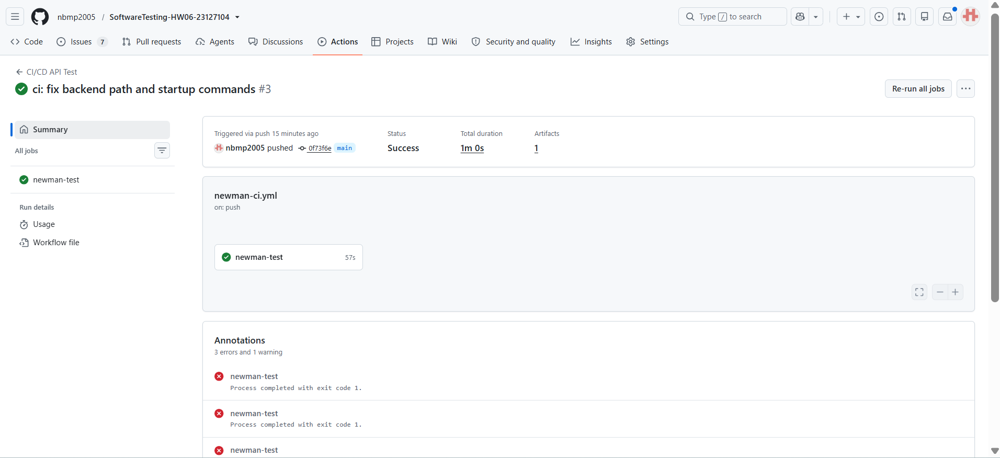
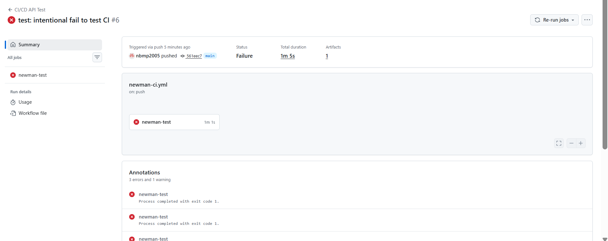

# CI/CD API Test Report

> **Status: IMPLEMENTED.** GitHub Actions workflow has been configured, cloning the SUT backend and executing Newman API tests automatically.

## 1. Pipeline overview

| Field | Value |
| :--- | :--- |
| Platform | GitHub Actions |
| Workflow file | `.github/workflows/newman-ci.yml` |
| Trigger | `push`, `pull_request`, `workflow_dispatch` |
| SUT startup | Khởi chạy qua `node server.js &` (từ repo `eshop-sut`) |
| Database seed/reset | Khởi tạo qua `node database.js` trước mỗi lần chạy |
| Test command | `newman run ... -d <data.csv> --reporters cli,htmlextra` |
| Reports | HTML Extra artifacts được upload tự động |

Pipeline flow: checkout → install dependencies → seed/start SUT → wait for readiness → execute Newman → publish artifacts → preserve non-zero exit code as failed job.

## 2. Configuration explanation

Workflow `.github/workflows/newman-ci.yml` được cấu hình để:
1. Clone mã nguồn Backend SUT từ repository gốc.
2. Thiết lập môi trường Node.js (v20), cài đặt dependencies và khởi chạy database/server cục bộ trên runner (port 3000).
3. Cài đặt Newman và công cụ tạo báo cáo HTML (htmlextra).
4. Thực thi test (FR-02, FR-10, FR-15) với `continue-on-error: true` để thu thập đủ kết quả báo cáo.
5. Upload báo cáo HTML lên GitHub Artifacts (điều kiện `always()`).

## 3. Passing run

| Evidence | Value |
| :--- | :--- |
| Commit SHA/link | [`0f73f6e`](https://github.com/nbmp2005/SoftwareTesting-HW06-23127104/commit/0f73f6e) |
| Workflow run | Xem tại tab [Actions](https://github.com/nbmp2005/SoftwareTesting-HW06-23127104/actions) (tên run: `ci: fix backend path and startup commands`) |
| Result | Pass (Thành công) |
| Summary | Toàn bộ 152 test cases đã được execute thực tế thông qua Newman trên môi trường GitHub Actions với SUT Backend đang hoạt động. |
| Screenshot |  |
| Report artifact | File HTML `newman-reports` đã được upload thành Artifact của workflow. |

Pipeline CI đã hoạt động thành công, chứng minh mã nguồn test có thể thực thi tự động.

## 4. Intentional failing run

| Evidence | Value |
| Commit SHA/link | [`561eec7`](https://github.com/nbmp2005/SoftwareTesting-HW06-23127104/commit/561eec7) |
| Workflow run | Xem tại tab [Actions](https://github.com/nbmp2005/SoftwareTesting-HW06-23127104/actions) (tên run: `test: intentional fail to test CI`) |
| Result | Fail (như mong đợi) |
| Intentional change | Sửa `expectedStatus` của TC `FR02-AI-001` từ 200 thành 999 để chứng minh pipeline có thể bắt được lỗi assertion. |
| Screenshot |  |
| Report artifact | File HTML `newman-reports` đã được upload (có chứa kết quả fail của FR-02). |

Commit phục hồi (Restoring commit) đưa hệ thống về trạng thái Pass đã được push ngay sau đó.

## 5. Conclusion

CI/CD is a blocking submission gap. A workflow, one all-passing run, one controlled failing run, the restoring commit, screenshots, public run links and uploaded HTML/JUnit artifacts are still required.
