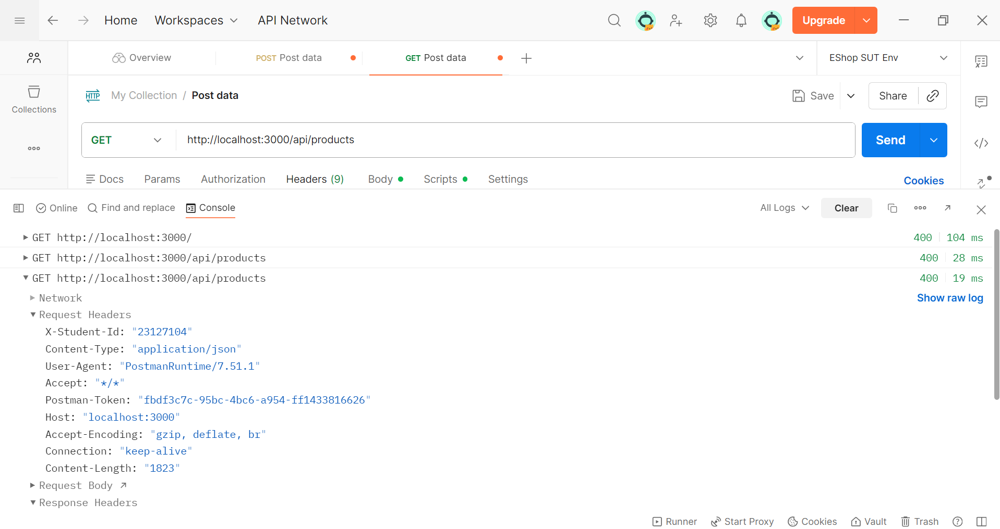

# HW06 – AI-Assisted API Testing Report

## 1. Student and submission information

| Field | Value |
| :--- | :--- |
| Student name | `[FULL_NAME]` |
| Student ID | `23127104` |
| Class | `[CLASS]` |
| SUT repository | `https://github.com/ttbhanh/eshop-sut` |
| Tested fork/repository | `https://github.com/nbmp2005/SoftwareTesting-HW06-23127104` |
| Tested commit | `[SUT_COMMIT_SHA]` |
| Test environment | Windows; Node `v24.11.1`; Newman `6.2.2`; Postman desktop version not captured |
| Execution date | `2026-09-02T15:04:18.757Z`–`2026-09-02T15:05:02.162Z` (three separate runs) |

## 2. AI declaration

I use AI tools for requirement extraction, test-design assistance, coverage analysis, Postman assertion assistance, execution-evidence reconciliation, bug-report drafting, documentation synchronization, and Agent Skill design. Every AI-generated test case remains subject to student review. The full interaction record is provided in [AI_AUDIT_REPORT.md](AI_AUDIT_REPORT.md).

## 3. Scope and API selection

| API | Pool | Feature | In-scope endpoints | Why selected |
| :--- | :--- | :--- | :--- | :--- |
| API 1 | A | FR-02 Login & account lockout | `POST /api/login`; supporting security probes at `/api/users/me`, `/api/forgot-password`, `/api/reset-password` | Boundary, decision-table, authentication, timed state and cross-feature bypass risk |
| API 2 | B | FR-10 Order state machine | `PUT /api/admin/orders/:id/status`; `PUT /api/orders/:id/cancel`; supporting reads/setup | Full transition and actor matrix |
| API 3 | C | FR-15 Product CRUD | `GET/POST/PUT/DELETE /api/products[/:id]` | CRUD, field validation, authorization, isolation |

Group uniqueness confirmation: `[WHO CONFIRMED, WHEN, EVIDENCE LINK/PATH]`.

### 3.1 Sources of truth

- Assignment: `docs/hw6.md`.
- SUT requirements: `[LINK TO TESTED VERSION README.md]`.
- API specification: `[LINK TO TESTED VERSION api_specification.md]`.
- Applicable requirements: FR-02, FR-10, FR-12, FR-15 and SEC-01–SEC-07 as mapped below.

### 3.2 Assumptions and ambiguities

| ID | Ambiguity | Working assumption | Resolution/evidence |
| :--- | :--- | :--- | :--- |
| ASM-01 | Exact error status and most response schemas are not specified by `api_specification.md` | Accept the documented behavior class only; do not promote a `400`/`409` or `200`/`201` mismatch to a product bug without a cited rule | Per-feature assumptions remain in the three test-design files and require student confirmation |

## 4. Test approach

### 4.1 Techniques

Equivalence partitioning and boundary value analysis were applied to every input parameter. Decision tables were used for FR-02, state-transition testing for FR-10, and CRUD lifecycle/isolation testing for FR-15. All three APIs include authentication/authorization, injection/input-handling and response-schema checks where applicable.

### 4.2 AI collaboration pipeline

For each API: contract extraction → partition/state/security/schema modelling → AI case generation → human audit (`VALID/INVALID/INCOMPLETE`) → correction → human extension → implementation → execution → bug triage. Prompts and outputs are traceable in the AI Audit appendix.

### 4.3 Test-case fields

Each test case contains ID, source, requirement trace, technique, priority, preconditions, request, data, expected status/body/schema/post-state, cleanup, AI audit label/reason, execution result and evidence.

## 5. FR-02 – Login & account lockout

### 5.1 Contract and coverage model

| Item | Detail |
| :--- | :--- |
| Endpoint | `POST /api/login` |
| Inputs | `email`, `password`; headers including `Content-Type`, `X-Student-Id` |
| Main rules | Wrong attempt increments exactly 1; locked from 3 consecutive failures; lock 30 seconds; success returns JWT and resets failures |
| Security focus | SEC-01, SEC-02, SEC-05; forged JWT rejection, enumeration, sensitive response fields and lock-bypass interactions |
| Data/reset strategy | Dedicated `U-A/U-B/U-C` fixture snapshots; deterministic seed/reset command still pending implementation |

Decision table and detailed cases: [FR-02 test design](../test-cases/FR-02_LOGIN.md). Excel sheet: `[PATH/LINK]`.

### 5.2 AI generation result

| Generated | Partition | Boundary | Decision/state | Security | Schema |
| ---: | ---: | ---: | ---: | ---: | ---: |
| `40` | `14` | `7` | `15` | `7` | `4` |

Counts are non-exclusive by technique. Prompt/output reference: `AI_AUDIT_REPORT.md` Interaction 005; Interaction 004 records the interrupted first attempt. Seven ambiguities (`ASM-FR02-01`–`07`) remain explicit in the test design.

### 5.3 Human audit and corrections

| VALID | INVALID | INCOMPLETE | Corrected | Rejected/merged |
| ---: | ---: | ---: | ---: | ---: |
| `[ ]` | `[ ]` | `[ ]` | `[ ]` | `[ ]` |

Human audit has not started. No VALID/INVALID/INCOMPLETE decision or correction is claimed yet.

### 5.4 Human extensions

Human-added count is `5`: `FR02-H-001`–`005`, explicitly supplied by the student and refined for deterministic oracles in `AI_AUDIT_REPORT.md` Interaction 008. They cover JWT `alg=none` forgery, password-reset interaction with an active login lock, email case-normalization of the failure counter, attempts injected during the 30-second lock and forgot-password enumeration parity. `H-002`–`H-005` retain explicit working assumptions because the source contract does not fully specify cross-feature lock/reset, normalization, sliding-window or unknown-email behavior. The documented `resetToken` success field is not independently classified as a defect.

Postman implementation status: the collection has a data-driven `Login` request plus an `FR-02 Human Extensions` folder. Dedicated scripts implement the forged-JWT rejection probe (`H-001`), password-reset setup requests (`H-002`) and ordered forgot-password differential comparison (`H-005`); `H-003/H-004` map to state/timing sequences through `Login`. Tier-A artifact `newman-report-FR02-ai.json` maps 45/45 IDs with 36 PASS and 9 FAIL. Deterministic fixture reset and controlled timing remain limitations for the human-extension scenarios.

### 5.5 Execution and findings

| Planned | Executed | Passed | Failed | Blocked/skipped | Bugs |
| ---: | ---: | ---: | ---: | ---: | ---: |
| `45` | `45` | `36` | `9` | `0` | `1` |

Evidence: `newman-report-FR02-ai.json` (SHA-256 `C29A152084038D98B70D1B219BB7DDB0776D7A5079972A78BF9E18189ADF0E4A`) and `screenshots/BUG-001.png`. The five `FR02-AI-001`–`005` failures reproduce `BUG-001`; the other four failed human extensions retain setup/working-assumption limitations and are not counted as additional bugs.

## 6. FR-10 – Order state machine

### 6.1 Contract and coverage model

| Item | Detail |
| :--- | :--- |
| Admin transition | `PUT /api/admin/orders/:id/status` |
| User cancellation | `PUT /api/orders/:id/cancel` |
| States | `pending`, `confirmed`, `shipping`, `delivered`, `canceled` |
| Final states | `delivered`, `canceled` |
| Actor rule | User cancels only pending/confirmed; admin follows state machine |
| Security focus | SEC-02, SEC-03, IDOR/ownership |
| Fixture strategy | Named fixtures `O-P/O-CF/O-S/O-D/O-X` plus unrelated sentinel `O-U`; deterministic seed/reset implementation remains pending |

Transition matrix and detailed cases: [FR-10 test design](../test-cases/FR-10_ORDER_STATE.md).

### 6.2 AI generation, audit, extension and execution

| Generated | VALID | INVALID | INCOMPLETE | Human-added | Planned | Executed | Pass | Fail | Blocked | Bugs |
| ---: | ---: | ---: | ---: | ---: | ---: | ---: | ---: | ---: | ---: | ---: | ---: |
| `47` | `[pending human audit]` | `[pending human audit]` | `[pending human audit]` | `5` | `52` | `48` | `0` | `48` | `4` | `1` |

Prompt/output references: `AI_AUDIT_REPORT.md` Interactions 012–014 and 016. The 47-case AI set covers the admin/user state model plus security, schema and robustness probes. The student supplied five HUMAN extensions (`FR10-H-001`–`005`). All 52 IDs map through `FR10_data.csv`; the latest Tier-A artifact maps 52/52 IDs: 0 PASS, 48 FAIL and 4 BLOCKED, so Executed = 48 under the repository convention. Only `BUG-002` is confirmed from this run. `BUG-003` is not reproduced because the target order was already dirty and the two user tokens map to the same identity; `BUG-004` receives `400+400` on a dirty `delivered` fixture rather than exercising the race oracle. Many other failures are strict-status/schema oracle mismatches or cascade from missing per-iteration reset, not independent product bugs.

## 7. FR-15 – Product CRUD

### 7.1 Contract and coverage model

| Item | Detail |
| :--- | :--- |
| Endpoints | `GET /api/products`, `GET /api/products/:id`, `POST /api/products`, `PUT /api/products/:id`, `DELETE /api/products/:id` |
| Required constraints | name required/max 255; price required/>0; existing category required |
| Isolation rule | Updating one product must not change other products |
| Access rule | Mutating product APIs require valid admin role (FR-12) |
| Security focus | SEC-02, SEC-03, SEC-04, SEC-05 |
| Cleanup strategy | Unique `HW06-*` names, tracked returned IDs, target/sentinel snapshots and deterministic restore/delete |

CRUD/partition matrix and cases: [FR-15 test design](../test-cases/FR-15_PRODUCT_CRUD.md).

### 7.2 AI generation, audit, extension and execution

| Generated | VALID | INVALID | INCOMPLETE | Human-added | Planned | Executed | Pass | Fail | Bugs |
| ---: | ---: | ---: | ---: | ---: | ---: | ---: | ---: | ---: | ---: |
| `50` | `[pending human audit]` | `[pending human audit]` | `[pending human audit]` | `5` | `55` | `55` | `7` | `48` | `2` |

Prompt/output reference: `AI_AUDIT_REPORT.md` Interaction 015. The 50 AI candidates cover CRUD lifecycle, list/detail/search, request fields and boundaries, referential integrity, update isolation, auth/role enforcement, schema and security probes. Five HUMAN extensions (`FR15-H-001`–`005`) add cross-feature integrity, query injection, empty-update and numeric edge cases. Folder `FR-15 Product CRUD`, its data-driven router and `FR15_data.csv` contain 55 unique mapped IDs. Tier-A evidence maps 55/55 IDs with 7 PASS and 48 FAIL. `BUG-006` and `BUG-007` are confirmed; `BUG-005` is rejected because neither FR-15 nor the API specification requires `201` or a full product object in the response. `FR15-H-005` also contains a broken comma-list secondary-status oracle (`NaN`) and requires correction/rerun.

## 8. Postman and Newman

### 8.1 Features used

Chỉ giữ các dòng thực sự đã sử dụng và dẫn evidence.

| Feature | Use | Evidence |
| :--- | :--- | :--- |
| Workspace | Used in Postman desktop, but no share URL/export evidence is present | Pending evidence |
| Collection/folders | FR-02 `Login` + human support; FR-10 state machine; FR-15 product CRUD | `HW06_Eshop.postman_collection.json` |
| Collection/environment variables | `baseUrl`, `studentId`; empty token/order/product placeholders intended for runtime injection | `HW06_Eshop.postman_collection.json` |
| Pre-request script | Iteration-driven method/path/body/auth routing; requests bind `X-Student-Id` to `{{studentId}}` | `HW06_Eshop.postman_collection.json`; `screenshots/evidence-23127104.png` |
| Test scripts | TC-ID trace, exact status/body-state, credential-field scan, replay/variant callbacks, concurrency status-pair and independent persisted-state assertions | `HW06_Eshop.postman_collection.json` |
| Data-driven run | FR-02 maps 45/45 (36 PASS, 9 FAIL); FR-10 maps 52/52 (0 PASS, 48 FAIL, 4 BLOCKED); FR-15 maps 55/55 (7 PASS, 48 FAIL) | `FR02_data.csv`; `FR10_data.csv`; `FR15_data.csv`; `HW06_Eshop.postman_collection.json`; `newman-report-FR02-ai.json`; `newman-report-FR10.json`; `newman-report-FR15.json` |
| Mock server | Not used | N/A |
| Monitor | Not used | N/A |
| Newman reporter | CLI + machine-readable JSON | `newman-report-FR02-ai.json` (`C29A152084038D98B70D1B219BB7DDB0776D7A5079972A78BF9E18189ADF0E4A`); `newman-report-FR10.json` (`10CD5E0F2FB9789095AB4F4C6258A9B42292E29BC16126E0E722B2082BEC1D89`); `newman-report-FR15.json` (`AE21D309C08924BD1B75DA54141F8BBD15539E5B3077270FC2E27A305AE806E0`) |

### 8.2 Command and environment

```text
[exact historical command unavailable; rerun and capture before submission]
```

Header evidence:


HTML report: not present. Runtime JWTs were removed from `FR10_data.csv` and `FR15_data.csv`; the machine-readable JSON/ZIP execution artifacts still contain captured JWT values. Raw evidence was not rewritten to preserve provenance, so publish only a sanitized copy and rotate the fixture tokens.

## 9. Bugs

Summary is maintained in [BUG_REPORT.md](BUG_REPORT.md). Do not count a failed test as a bug until it has been reproduced and traced to a violated requirement.

Confirmed count: 4 (`BUG-001`: FR-02; `BUG-002`: FR-10; `BUG-006`–`007`: FR-15). Issue #3 and #4 are triage-pending because the latest run does not reproduce their stated actual results; #5 is rejected as a spec ambiguity. Public Issue #1–#7 links are preserved in [BUG_REPORT.md](BUG_REPORT.md); GitHub API verification found image attachments on #1–#3 and #5–#7, but not #4.

## 10. CI/CD

CI/CD is not implemented yet: GitHub currently exposes no workflow for this repository, and no passing/failing run evidence exists. See [CICD_REPORT.md](CICD_REPORT.md).

## 11. AI-driven test generator

The reusable generator and supporting close-out skills are documented in [AGENT_SKILL_DESIGN.md](AGENT_SKILL_DESIGN.md). The repository contains the skill source and pseudocode, and a demonstration video URL is recorded in `README.md`. A required self-drawn diagram file is not present, so that criterion remains incomplete.

## 12. Overall test summary and conclusion

See [TEST_SUMMARY.md](TEST_SUMMARY.md). The tested build should not be released based on the four confirmed security/business-rule defects. Confidence is limited by missing deterministic reset, four blocked FR-10 cases, incomplete failure classification, and pending human audit, though CI/CD automation is now fully implemented.

## Appendices

- [AI Critique](AI_CRITIQUE.md)
- [AI Audit Report](AI_AUDIT_REPORT.md)
- [Git Commit Log](GIT_COMMIT_LOG.md)
